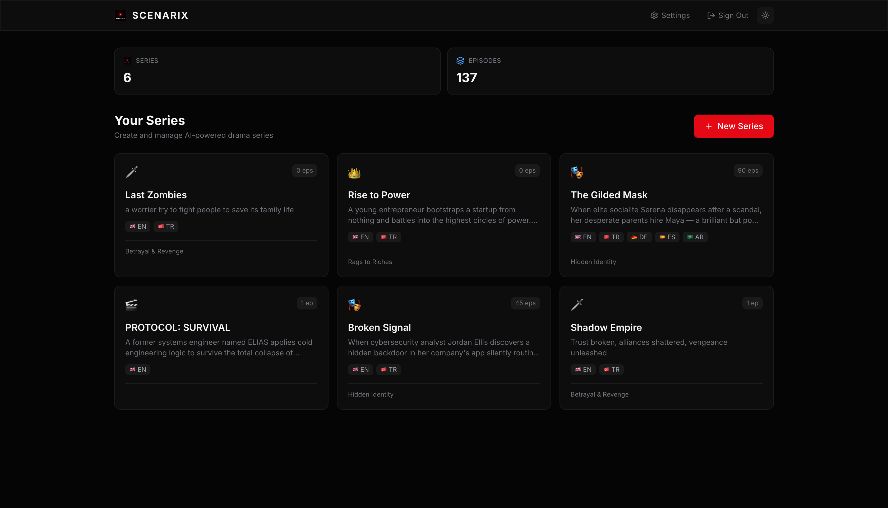
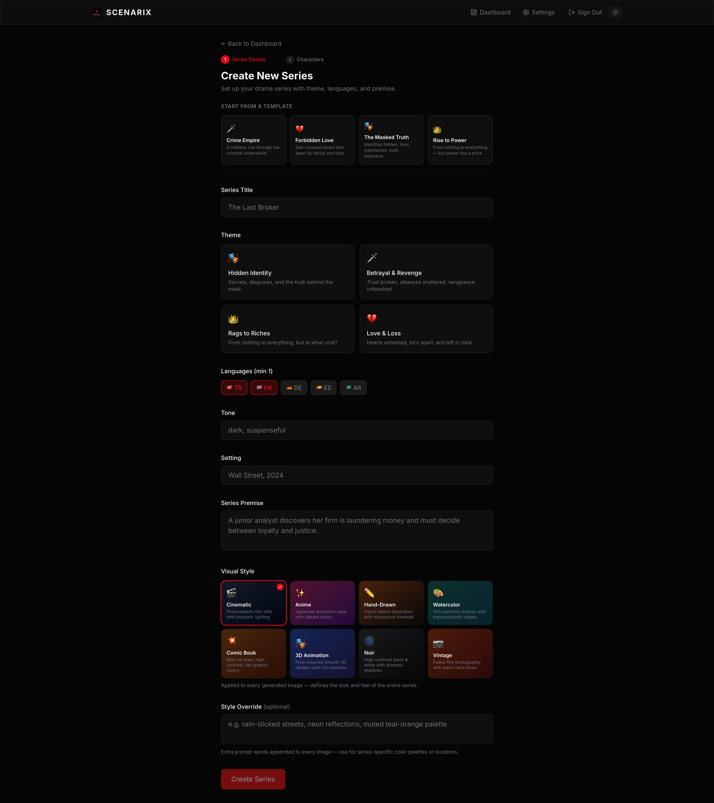
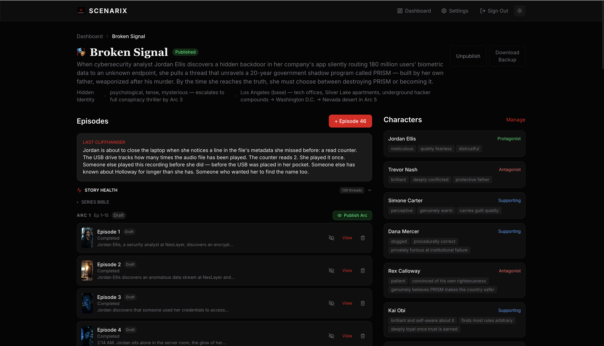
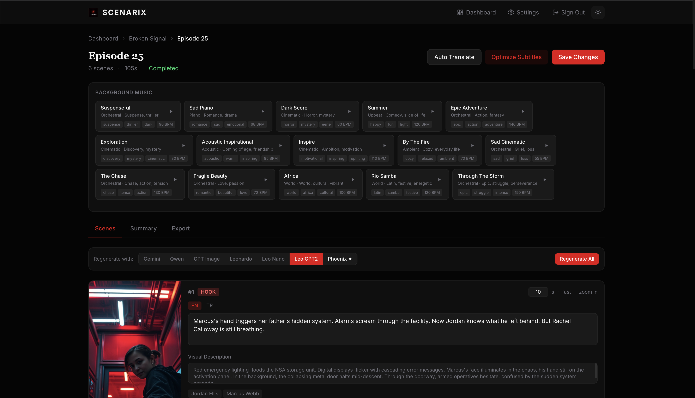
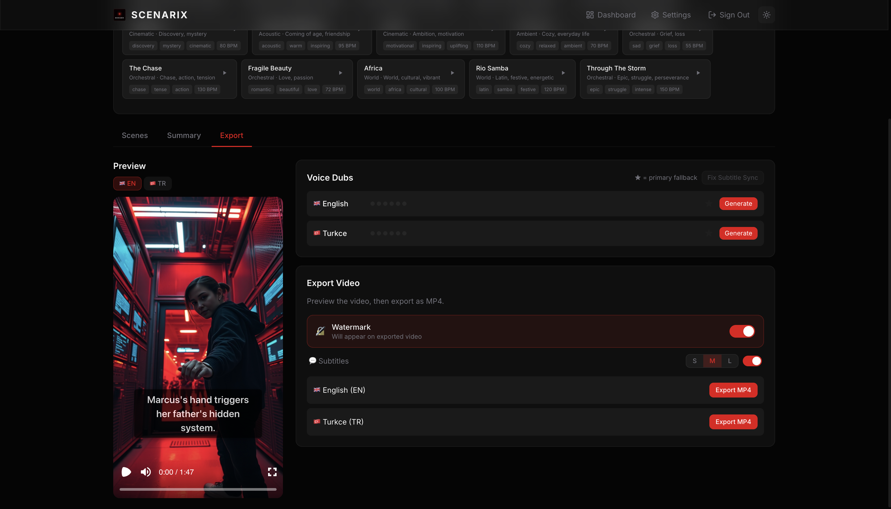
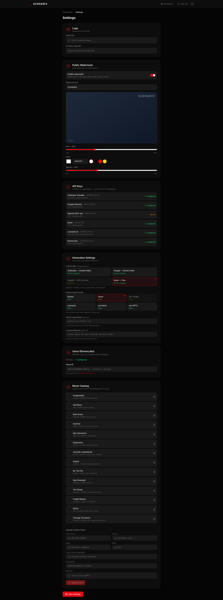

# Kineva

Producto de series dramáticas cortas (9:16) con IA.

**Branding visible:** Kineva.

Kineva is based on the open-source Scenarix project by Yakup Bülbül,
used under the MIT License.

El aviso de copyright y el texto de licencia se conservan en `LICENSE` y `NOTICE`. Scenarix no es la marca comercial de este producto.

---

# Scenarix (upstream)

I built this to generate short-form drama series end-to-end: screenplays, images, voiceovers, subtitles, background music — exported as vertical video. The whole pipeline runs from a single admin panel, or you can drive it from your editor via MCP tools.

It supports multiple AI providers (Anthropic, Google, OpenAI, Qwen for text; Gemini, Leonardo, OpenAI, Qwen for images), so you're not locked into any one service. Plug in whichever API keys you have and it works.













## What it does

- Generates screenplays with a series bible that tracks characters, plot threads, and cliffhangers across episodes
- Creates scene images through multiple providers (you pick per-episode)
- Translates episodes to other languages automatically
- Generates voiceover narration with free generic neural TTS (edge-tts); ElevenLabs is an optional later switch
- Exports 9:16 vertical video with subtitles, watermark, and background music using Remotion
- Scores each episode on tension, voice consistency, cliffhangers, and continuity
- Ships with 15 royalty-free background tracks, plus you can upload your own
- Includes an MCP server with 13 tools so Claude Code, Cursor, or Copilot can create and manage series conversationally

## Getting started

You need Node.js 20+ (22 recommended), PostgreSQL 14+, and at least one AI API key.

```bash
git clone https://github.com/yakupbulbul/scenarix.git
cd scenarix
npm install

cp .env.example .env.local
# Fill in your database URL and API keys

npx prisma db push
node prisma/seed.mjs

npm run dev
```

Open `localhost:3000`, log in with the credentials you set in `.env.local`. That's it.

For Docker, `docker compose up -d` starts PostgreSQL and the app together.

All environment variables are documented in `.env.example`.

## MCP tools

Scenarix has an MCP server that lets AI coding assistants create series, generate episodes, translate, and manage plot threads — all through natural conversation. There are 13 tools total.

Config files are already included for Claude Code (`.claude/mcp.json`), Cursor (`.cursor/mcp.json`), and VS Code (`.vscode/mcp.json`). Just open the project and the tools are available.

The only setup: set `CLI_API_KEY` in your `.env.local` and make sure the dev server is running.

For other MCP clients:

```json
{
  "mcpServers": {
    "scenarix": {
      "command": "node",
      "args": ["mcp/server.mjs"],
      "env": {
        "SCENARIX_URL": "http://localhost:3000"
      }
    }
  }
}
```

Here's what a typical session looks like:

```
You: Create a crime drama series called "The Last Deal"
Claude: [calls create_series] Done — Series ID: 7

You: Add a protagonist named Victor, a retired detective with a scar on his left cheek
Claude: [calls create_character] Created — ID: 12

You: Generate episode 1 with Qwen images
Claude: [calls create_episode] Episode 1 ready
  Quality: 8.2/10
  Cliffhanger: "Victor stares at the photo — it's the same face from 20 years ago."

You: Translate to Turkish and German
Claude: [calls translate_series] Done — 2 languages, 1 episode
```

## Tech stack

Next.js 16 (App Router), React 19, PostgreSQL with Prisma 7, Tailwind CSS 4, Remotion 4 for video, JWT auth via jose.

## Contributing

PRs are welcome. For anything bigger than a bug fix, open an issue first so we can discuss the approach.

## Support

If you find Scenarix useful, consider buying me a coffee:

<a href="https://www.buymeacoffee.com/yakupbulbul" target="_blank"></a>

## License

[MIT](LICENSE)
